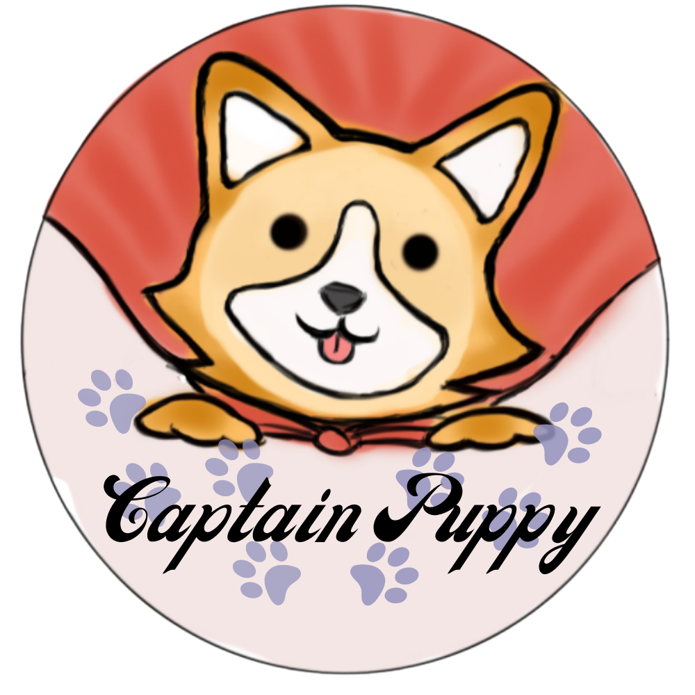

# Captain Puppy

Captain Puppy is a pet management application made using Dart programming language. It was implemented with the use of the Android Studio IDE and the Flutter open-source framework. 

## Features
*  Create a profile for your dog, 
*  Track the expenses you've made for your pet, 
*  Write notes of information, 
*  Search various information regarding different dog breeds. 

